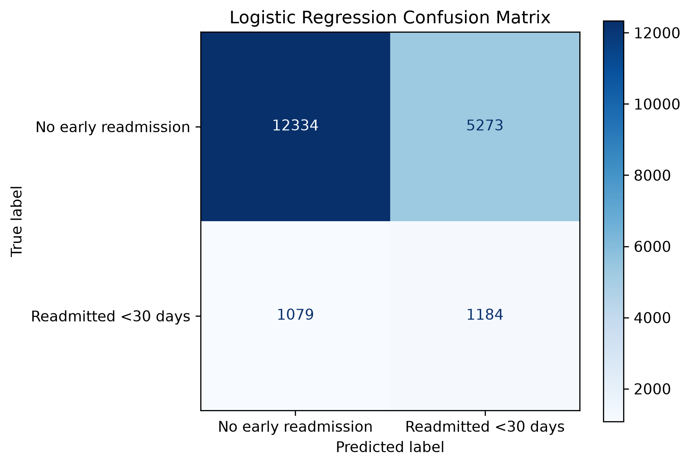
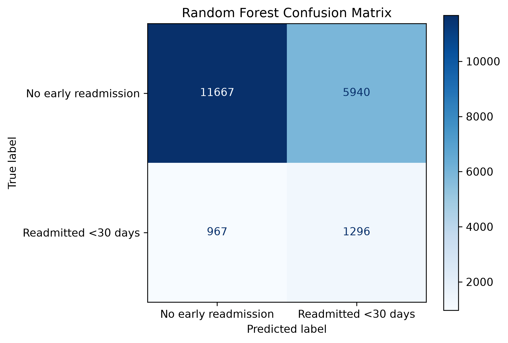
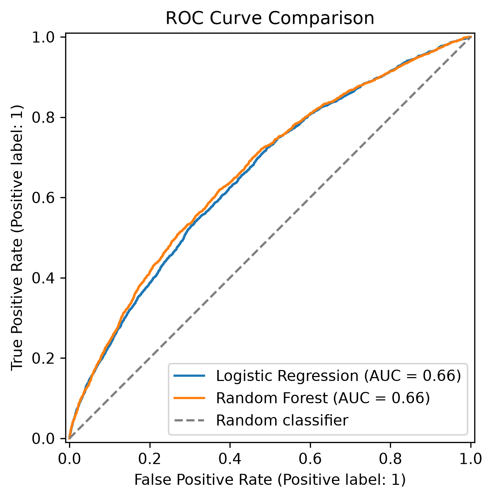
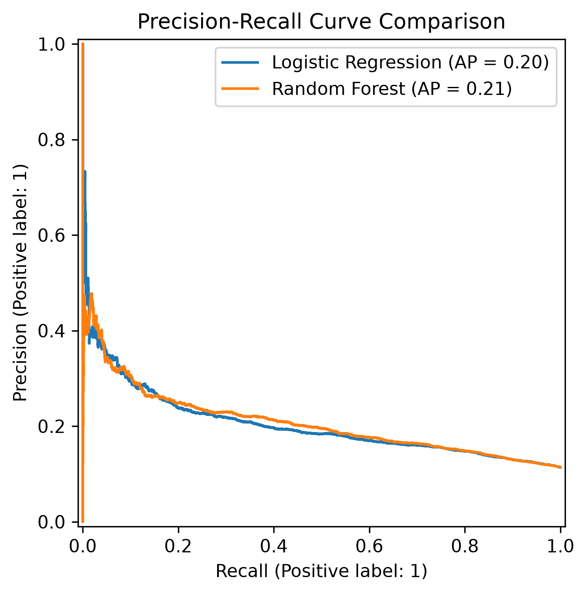
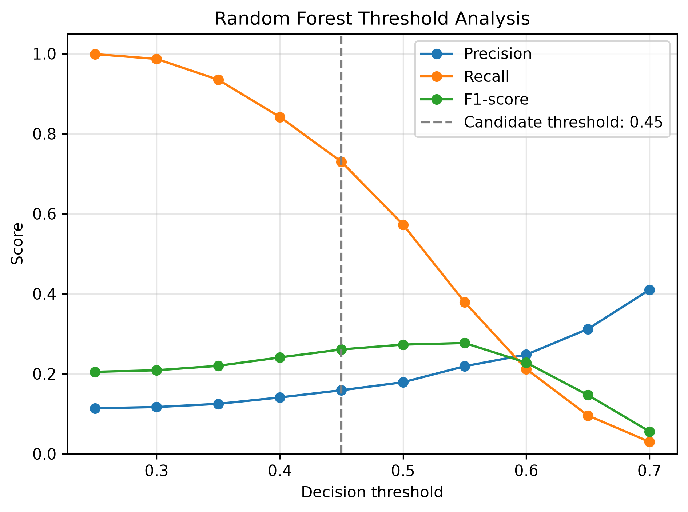
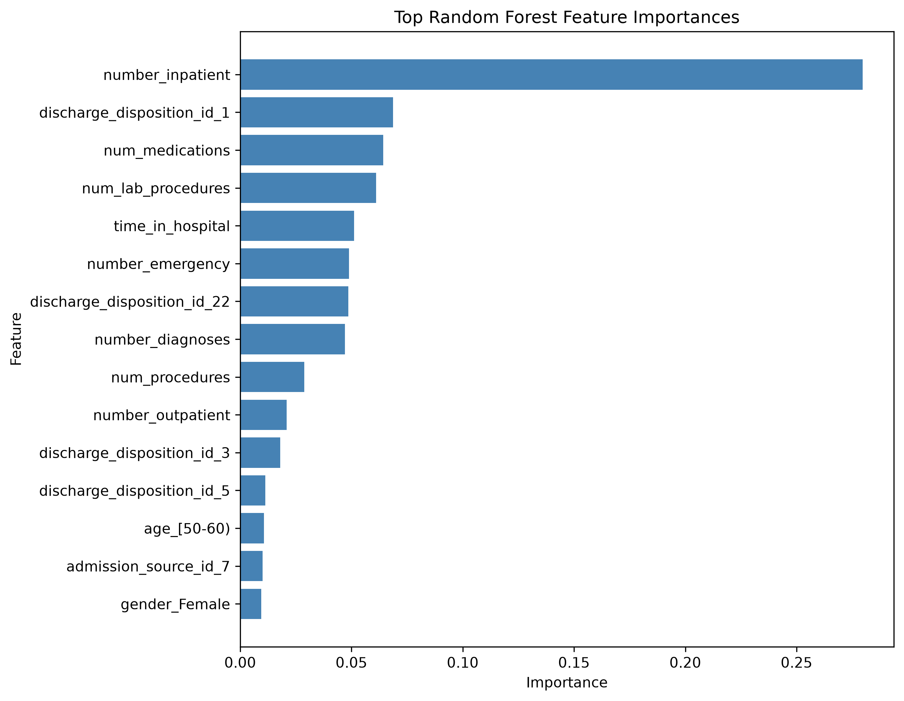

# Hospital Readmission Prediction

[](https://github.com/masoumhv/Diabetes-130US-Readmission-Prediction/actions/workflows/ci.yml)

A reproducible machine-learning pipeline for predicting whether a patient with diabetes will be readmitted to a hospital within 30 days.

The project uses the **Diabetes 130-US Hospitals dataset** and focuses on responsible cohort definition, patient-level data splitting, class imbalance, model evaluation, threshold analysis, and interpretable reporting.

## Research Question

Can demographic, admission, treatment, and previous healthcare-utilization information identify patients at risk of hospital readmission within 30 days?

The prediction target is defined as:

- `1`: readmitted within 30 days (`<30`)
- `0`: not readmitted or readmitted after more than 30 days (`NO` or `>30`)

## Dataset

The project uses the [Diabetes 130-US Hospitals dataset from the UCI Machine Learning Repository](https://archive.ics.uci.edu/dataset/296/diabetes+130+us+hospitals+for+years+1999+2008).

The original dataset contains:

- 101,766 hospital encounters
- 50 variables
- Data collected from 130 US hospitals
- Encounters recorded between 1999 and 2008

The raw dataset is not included in this repository. Download the following files from UCI and place them inside `data/raw/`:

```text
diabetic_data.csv
IDS_mapping.csv
```

## Cohort Definition

Patients who died or were discharged to hospice were excluded because they do not have the same opportunity for future hospital readmission.

The following `discharge_disposition_id` values were excluded:

| Code | Description |
|---:|---|
| 11 | Expired |
| 13 | Hospice / home |
| 14 | Hospice / medical facility |
| 19 | Expired at home |
| 20 | Expired in a medical facility |
| 21 | Expired, place unknown |

This exclusion removed 2,423 encounters and left 99,343 encounters in the analytical cohort.

## Data Processing

The pipeline performs the following steps:

1. Loads the raw CSV dataset.
2. Converts `?` values to missing values.
3. Removes columns with excessive missingness:
   - `weight`
   - `payer_code`
4. Replaces missing categorical values with `Unknown`.
5. Excludes death and hospice discharge records.
6. Creates a binary 30-day readmission target.
7. Selects numerical and categorical predictors.
8. Splits the data at the patient level.
9. Standardizes numerical features.
10. One-hot encodes categorical features.
11. Trains and evaluates classification models.
12. Saves tables and visualizations in `results/`.

## Features

### Numerical features

- `time_in_hospital`
- `num_lab_procedures`
- `num_procedures`
- `num_medications`
- `number_outpatient`
- `number_emergency`
- `number_inpatient`
- `number_diagnoses`

### Categorical features

- `race`
- `gender`
- `age`
- `admission_type_id`
- `discharge_disposition_id`
- `admission_source_id`
- `max_glu_serum`
- `A1Cresult`
- `change`
- `diabetesMed`

After preprocessing, the 18 original predictors are transformed into 89 model-ready features.

## Preventing Data Leakage

A patient may have multiple encounters in the dataset.

A conventional random row-level split could place different encounters from the same patient in both training and testing data. This would produce an overly optimistic evaluation.

The project therefore uses `StratifiedGroupKFold` with `patient_nbr` as the grouping variable. This provides:

- No patient overlap between training and testing data
- Approximate preservation of the target-class distribution
- A more realistic evaluation on previously unseen patients

## Models

Two models were evaluated:

- Logistic Regression
- Random Forest

Both models use class weighting to address the imbalance between patients with and without early readmission.

## Model Performance

| Model | Accuracy | Precision | Recall | F1-score | ROC-AUC |
|---|---:|---:|---:|---:|---:|
| Logistic Regression | 0.680 | 0.183 | 0.523 | 0.272 | 0.657 |
| Random Forest | 0.652 | 0.179 | **0.573** | **0.273** | **0.665** |

Logistic Regression achieved higher accuracy and slightly higher precision.

Random Forest identified a larger proportion of patients who were actually readmitted within 30 days. Because missing a high-risk patient may be more important than producing an additional screening alert, recall is emphasized in this analysis.

However, the low precision indicates that many predicted high-risk patients were not readmitted. The models should therefore be interpreted as experimental screening models, not deployment-ready clinical decision systems.

## Confusion Matrices

### Logistic Regression



### Random Forest



## ROC Curve



The ROC-AUC results indicate moderate discrimination. Random Forest slightly outperformed Logistic Regression, but the difference was small.

## Precision–Recall Curve



Because early readmission is the minority class, the Precision–Recall curve is especially useful for evaluating performance on high-risk patients.

## Threshold Analysis

The default classification threshold is `0.50`. Different thresholds were evaluated to examine the trade-off between precision and recall.



Lower thresholds identify more readmitted patients but generate more false-positive alerts. Higher thresholds improve precision but miss more high-risk patients.

A clinical operating threshold should not be selected from model performance alone. It must also consider intervention cost, hospital capacity, patient impact, and external clinical validation.

## Feature Importance



The most influential Random Forest features included:

- Previous inpatient visits
- Discharge destination
- Number of medications
- Number of laboratory procedures
- Length of hospital stay
- Previous emergency visits
- Number of recorded diagnoses

Previous inpatient utilization was the most influential model feature.

Feature importance describes how strongly the trained model used a variable. It does not establish the direction of an association or demonstrate causality.

## Project Structure

```text
Diabetes-130US-Readmission-Prediction/
├── data/
│   ├── raw/
│   └── processed/
├── results/
│   ├── model_comparison.csv
│   ├── logistic_confusion_matrix.png
│   ├── random_forest_confusion_matrix.png
│   ├── roc_curve.png
│   ├── precision_recall_curve.png
│   ├── random_forest_thresholds.csv
│   ├── random_forest_threshold_analysis.png
│   ├── random_forest_feature_importance.csv
│   └── random_forest_feature_importance.png
├── src/
│   ├── data_cleaning.py
│   ├── data_inspection.py
│   ├── data_loading.py
│   ├── data_splitting.py
│   ├── evaluation.py
│   ├── feature_engineering.py
│   ├── model.py
│   ├── model_analysis.py
│   ├── preprocessing.py
│   └── visualization.py
├── tests/
│   ├── test_data_processing.py
│   └── test_data_splitting.py
├── main.py
├── requirements.txt
├── .gitignore
└── README.md
```

## Installation

Clone the repository:

```bash
git clone https://github.com/masoumhv/Diabetes-130US-Readmission-Prediction.git
cd Diabetes-130US-Readmission-Prediction
```

Create a virtual environment:

```bash
python -m venv .venv
```

Activate it on Windows PowerShell:

```powershell
.\.venv\Scripts\Activate.ps1
```

Install the dependencies:

```bash
python -m pip install -r requirements.txt
```
Install development dependencies for testing and linting:

```bash
python -m pip install -r requirements-dev.txt

Download the dataset from UCI and place the CSV files inside:

```text
data/raw/
```

Run the complete pipeline:

```bash
python main.py
```

Run the automated tests:

```bash
python -m pytest -v
```

## Reproducibility

The project uses fixed random seeds for data splitting and model training. Re-running the pipeline with the same dataset and dependency versions should reproduce the reported results.

Generated evaluation tables and figures are saved automatically inside the `results` directory.

## Tests

The automated tests currently verify:

- Correct conversion of the readmission target into binary classes
- Correct handling of missing values and excluded discharge records
- Absence of patient overlap between training and testing data
- Consistency between feature and target split sizes

## Limitations

- The dataset was collected between 1999 and 2008 and may not represent current clinical practice.
- The analysis does not include external validation on another hospital system.
- Class imbalance leads to low precision for early-readmission predictions.
- The selected features represent a baseline clinical and administrative feature set.
- Random Forest feature importance does not demonstrate causal relationships.
- Model probabilities have not been formally calibrated.
- The model is not intended for clinical deployment.

## Ethical and Clinical Considerations

This project is intended for research and educational purposes only.

A hospital-readmission model may affect patient follow-up and resource allocation. Before clinical use, such a model would require external validation, fairness analysis across patient groups, probability calibration, prospective evaluation, and review by clinical experts.

## Conclusion

The project demonstrates an end-to-end and leakage-aware machine-learning workflow for 30-day hospital readmission prediction.

The results show that previous healthcare utilization, particularly earlier inpatient admissions, contributes strongly to prediction. Random Forest provided slightly better recall and ROC-AUC than Logistic Regression, but overall discrimination remained moderate and precision remained low.

The findings highlight that correct cohort definition, patient-level validation, transparent reporting, and clinically meaningful evaluation are more important than presenting accuracy alone.